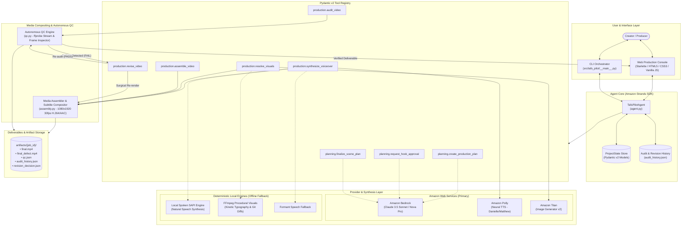
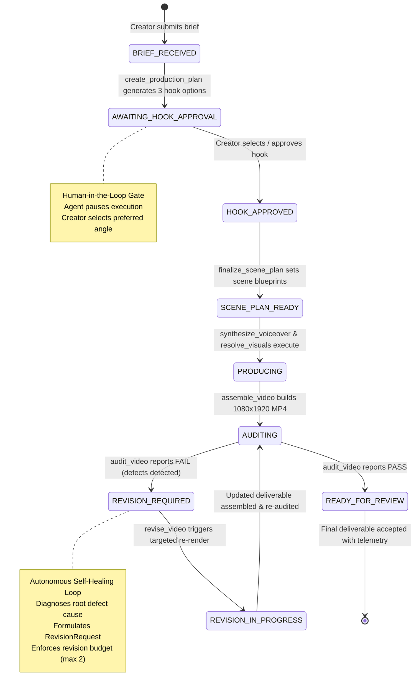
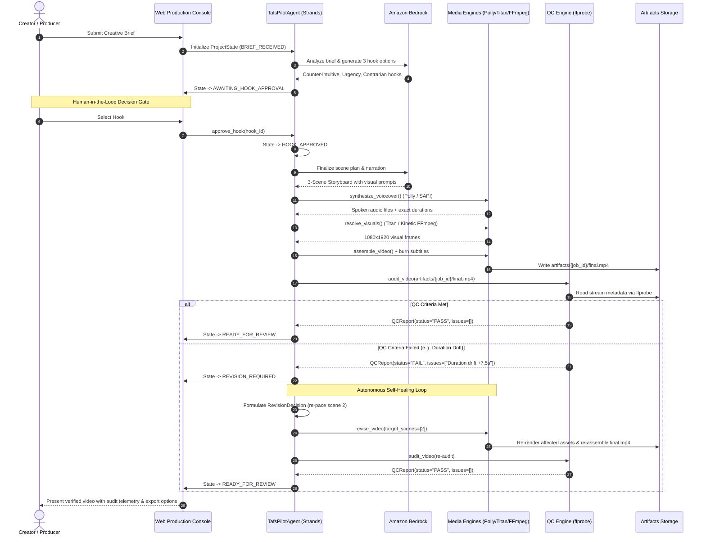

# Taf's Pilot: Architecture & System Design

> **Amazon Agents for Humans Hackathon** | **Track: Professional Agents**  
> *Autonomous Executive Video Producer & Creative Director*

---

## 1. System Overview

Taf's Pilot is an autonomous video production agent built on the **Amazon Strands Agents SDK** (`strands-agents`). Unlike single-turn generative AI tools that produce disconnected text, voice, or video snippets, Taf's Pilot takes full ownership of the entire video production lifecycle:

```text
Understand  ──>  Plan  ──>  Ask  ──>  Produce  ──>  Inspect  ──>  Correct  ──>  Deliver
```

The system is engineered as an **autonomous agent with human-in-the-loop oversight** and **self-healing closed-loop quality control**. It formulates creative strategies, pauses at critical decision gates for creator approval, coordinates multi-track media synthesis, audits its own deliverables using machine inspection (`ffprobe`), and autonomously executes surgical revisions when quality criteria are not satisfied.

---

## 2. High-Level Architecture Diagram



---

## 3. Production Lifecycle State Machine

Taf's Pilot enforces strict lifecycle state transitions managed by Pydantic v2 schemas in [`models.py`](../src/tafs_pilot/models.py). The agent cannot jump ahead or bypass quality inspection.



### State Definitions

| State | Description | Agent Action | Human Action |
|---|---|---|---|
| `BRIEF_RECEIVED` | Creative brief registered | Analyzes audience, tone, duration constraints | Submits initial brief |
| `AWAITING_HOOK_APPROVAL` | Hook proposals generated | Generates 3 differentiated hooks; pauses | Reviews and selects winning hook |
| `HOOK_APPROVED` | Hook locked in project state | Translates hook into multi-scene storyboard | None (Agent autonomous) |
| `SCENE_PLAN_READY` | Storyboard finalized | Schedules voiceover and visual asset tasks | None (Agent autonomous) |
| `PRODUCING` | Multi-track generation underway | Synthesizes speech, visual assets, generates SRT | None (Agent autonomous) |
| `AUDITING` | Compositing complete, QC in progress | Runs `ffprobe` inspection on audio, video, subtitles | None (Agent autonomous) |
| `REVISION_REQUIRED` | Machine inspection found defect | Formulates `RevisionDecision` and surgical plan | None (Agent autonomous) |
| `REVISION_IN_PROGRESS` | Executing surgical re-render | Re-renders only affected scenes, re-concatenates | None (Agent autonomous) |
| `READY_FOR_REVIEW` | Video passed all QC criteria | Packages deliverable, telemetry, and audit log | Reviews final video & approves |

---

## 4. Component Deep Dive

### 4.1 Agent Orchestrator (`agent.py`)
- Built on top of the **Amazon Strands Agents SDK** (`strands.Agent`).
- Configures Bedrock foundation models with automatic inference profile discovery (`anthropic.claude-3-5-sonnet-20241022-v2:0`, `amazon.nova-pro-v1:0`).
- Manages conversational memory, tool invocation chains, error recovery, and state serialization.
- Embeds the **Autonomous Self-Correction Loop**: when `audit_video` returns a failure, the agent determines the exact fix, generates a `RevisionRequest`, invokes `revise_video`, and re-verifies.

### 4.2 Planning & Production Tools (`tools/`)
All tools are registered as typed `@tool` functions with strict Pydantic v2 contracts:
- [`planning.py`](../src/tafs_pilot/tools/planning.py):
  - `create_production_plan`: Takes `CreativeBrief` and returns 3 strategic hook angles.
  - `request_hook_approval`: Halts execution at the human-in-the-loop gate.
  - `finalize_scene_plan`: Creates scene-by-scene narration and visual specifications.
- [`production.py`](../src/tafs_pilot/tools/production.py):
  - `synthesize_voiceover`: Generates speech audio and computes exact spoken durations.
  - `resolve_visuals`: Prepares 1080×1920 portrait visual frames.
  - `assemble_video`: Concatenates scenes with burned subtitles into a broadcast MP4.
  - `audit_video`: Executes deep automated QC inspection.
  - `revise_video`: Performs targeted scene re-renders.
  - `simulate_qc_defect`: Diagnostic utility to inject controlled defects for demo validation.

### 4.3 Media Pipeline (`media/`)
- **Speech Engine ([`audio.py`](../src/tafs_pilot/media/audio.py))**:
  - Primary: Amazon Polly neural voice synthesis (`Danielle`, `Matthew`).
  - Fallback: Local spoken speech via Windows SAPI with pitch/formant wave fallback. Spoken word cadence dictates precise scene timing.
- **Visual Engine ([`visuals.py`](../src/tafs_pilot/media/visuals.py))**:
  - Primary: Amazon Titan Image Generator v2 on Bedrock.
  - Procedural Graphics: Developer-focused kinetic typography and code diff animations using FFmpeg filtergraphs (macOS/terminal window headers, line counters, syntax colors, command prompts).
- **Assembly & Subtitles ([`assembly.py`](../src/tafs_pilot/media/assembly.py))**:
  - Subtitle beat segmentation: Splits narration into synchronized sentence beats (1–5 words) instead of monolithic paragraphs.
  - Mobile safe-zone styling: Libass styling (`FontSize=16`, `Bold=1`, `MarginV=65`, `Alignment=2`) positioned in the lower-third with contrast borders, preventing UI clipping on Reels, Shorts, and TikTok.
  - Video rendering: FFmpeg hardware/software H.264 encode, AAC audio, 1080×1920 vertical resolution at 30 fps.

### 4.4 Automated Quality Control Engine (`media/qc.py`)
Machine inspection powered by `ffprobe` analyzes rendered MP4 deliverables across 5 dimensions:
1. **Dimensions & Aspect Ratio**: Must match 1080×1920 (9:16 vertical orientation).
2. **Video & Audio Stream Health**: Valid H.264 stream and AAC audio stream must be present.
3. **Duration Tolerance**: Total runtime must match target duration within ±1.5s tolerance.
4. **Subtitle Presence**: Subtitle track verified as present and rendered.
5. **Frame Integrity**: Rejects black or empty frames.

When a defect is discovered, `qc.py` returns a structured `QCReport`:
```json
{
  "status": "FAIL",
  "duration": 28.5,
  "width": 1080,
  "height": 1920,
  "aspect_ratio": "9:16",
  "video_codec": "h264",
  "audio_codec": "aac",
  "subtitles_present": true,
  "issues": [
    "Duration drift: video duration 28.50s exceeds target 21.00s by 7.50s (tolerance: ±1.5s)"
  ]
}
```

### 4.5 Web Production Console (`web/`)
A responsive 3-column operations dashboard built with Starlette and vanilla web standards:
- **Column 1 — Creative Direction**: Topic, audience persona, tone, target runtime, and platform selection.
- **Column 2 — Studio & Agent Live Stream**: Real-time agent event stream, step-by-step lifecycle timeline, HTML5 video player with scanning radar overlay, real-time telemetry badge, and hook approval selector.
- **Column 3 — Artifact & Audit Inspector**: Side-by-side QC report badges, revision history timeline, and an interactive **Inspect Report Modal** displaying raw JSON telemetry and audit logs.
- **Demo Fast-Forward Button**: Injects a controlled QC defect and immediately exercises the autonomous self-correction loop in real time.

---

## 5. Sequence Diagram: Full Autonomous Lifecycle



---

## 6. AWS Service Integration & Honest Fallbacks

Taf's Pilot is natively architected for AWS services via Boto3:

| Service | Primary Role in Taf's Pilot | Local Offline Fallback Engine |
|---|---|---|
| **Amazon Bedrock** | Reasoning, brief strategy, hook formulation, revision planning | Deterministic heuristic rules & pre-computed strategic templates |
| **Amazon Polly** | Neural text-to-speech narration (`Danielle` / `Matthew`) | Local spoken speech (`SAPI.SpVoice`) with pitch/formant synthesis |
| **Amazon Titan Image Generator** | Photorealistic 9:16 portrait scene visuals | High-contrast developer kinetic typography & git diff animations (FFmpeg) |
| **AWS STS** | Identity verification and credential diagnostics | Graceful offline mode with full diagnostic disclosure |

### Honest Provider Reporting Principle
Taf's Pilot adheres strictly to submission integrity:
- Live AWS service calls are only reported as successful if verified live credentials respond with HTTP 200.
- If AWS credentials are missing or account verification is pending, the system **never simulates or fabricates AWS responses**.
- The exact provider used for each scene asset is stamped into the immutable `audit_history.json` and visible in the Web Console telemetry modal.

---

## 7. Quality Control Metrics & Acceptance Criteria

Every deliverable rendered by Taf's Pilot must satisfy all of the following machine-verified criteria before reaching the `READY_FOR_REVIEW` state:

```text
┌─────────────────────────┬────────────────────────────┬────────────────────────┐
│ QC Inspection Parameter │ Specification Target       │ Tolerance / Rule       │
├─────────────────────────┼────────────────────────────┼────────────────────────┤
│ Orientation & Size      │ 1080 × 1920 (Vertical)     │ Exact match required   │
│ Aspect Ratio            │ 9:16                       │ Exact match required   │
│ Video Stream Codec      │ H.264 (AVC)                │ Must be decodable      │
│ Audio Stream Codec      │ AAC                        │ Must be present        │
│ Runtime Duration        │ Brief target (e.g. 21.0s)  │ ±1.5s maximum drift    │
│ Subtitle Burn-in        │ Present on lower third     │ MarginV=65, no clipping│
│ Black / Frozen Frames   │ 0 seconds                  │ Complete frame reject  │
│ Revision Budget Limit   │ ≤ 2 revisions              │ Hard budget cutoff     │
└─────────────────────────┴────────────────────────────┴────────────────────────┘
```

---

## 8. Directory & File Organization

```text
src/tafs_pilot/
├── __init__.py              # Package initialization
├── __main__.py              # End-to-end CLI orchestrator
├── agent.py                 # Strands agent lifecycle & revision loop
├── config.py                # Environment configuration & AWS region
├── aws_diagnostics.py       # Non-destructive AWS STS/Bedrock/Polly diagnostic checks
├── models.py                # Pydantic v2 schemas: ProjectState, Brief, QCReport, etc.
├── tools/
│   ├── __init__.py          # Tool exports
│   ├── planning.py          # Brief analysis, hook generation, scene planning tools
│   └── production.py        # Speech, visuals, assembly, QC audit, and revision tools
├── media/
│   ├── __init__.py          # Media engines export
│   ├── assembly.py          # FFmpeg video concatenation & Libass subtitle burn-in
│   ├── audio.py             # Amazon Polly neural TTS & SAPI spoken fallback
│   ├── qc.py                # Automated ffprobe QC video inspection engine
│   └── visuals.py           # Amazon Titan generation & procedural motion graphics
└── web/
    ├── __init__.py          # Web package export
    ├── __main__.py          # Web server launcher CLI
    ├── server.py            # Starlette ASGI API & static asset server
    └── static/              # Dark professional UI dashboard (HTML/CSS/JS)
```
